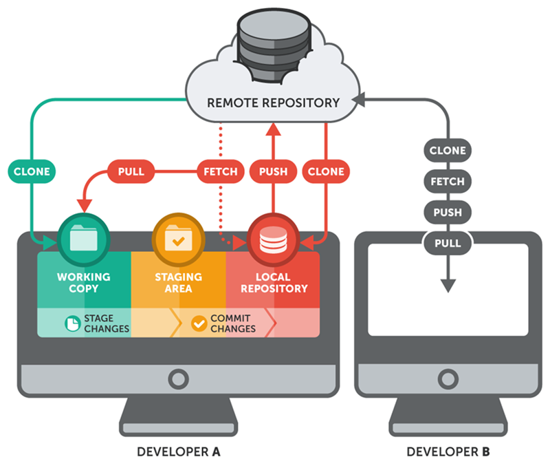
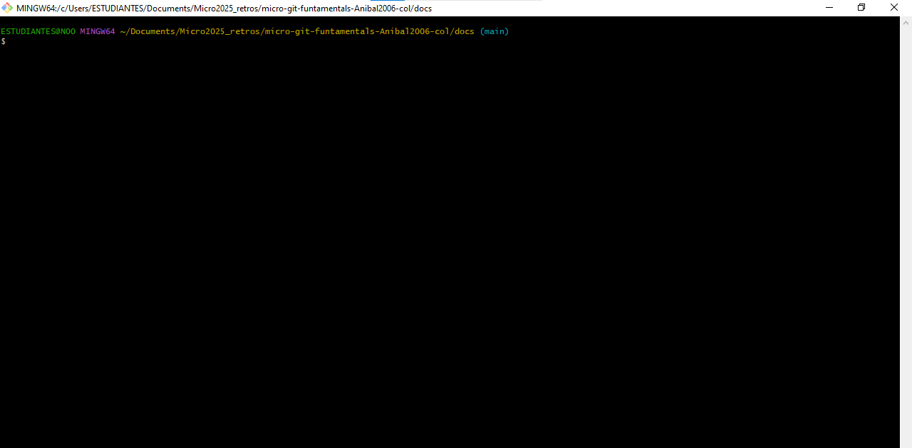
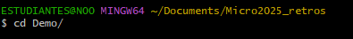
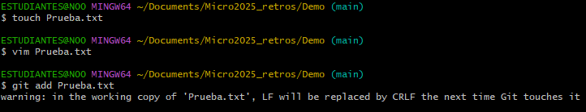
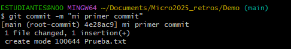
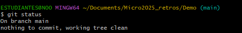

# Creación de un repositorio local
  

1. **Abrir Git Bash**:   
Primero se debe acceder a la terminal de Git bash en el sistema.  

2. **Navegar hasta la carpeta deseada**:  
- Se usa el comando cd ruta/del/directorio para moverte hacia el directorio donde quieres el repositorio.  

- Si se necesita crear una nueva carpeta para el repositorio, se usa el comando mkdir "nombre del proyecto" y finalmente se entra a la carpeta usando el comando cd.  
 

3. **Iniciar el repositorio**:  
Se ejecuta el comando git init para crear un nuevo repositorio vacio, generando así un subdirectorio oculto llamado . git, donde se almacenarán los datos del control de versiones.  
  

4. **Agregar archivos al repositorio**:  
- Despues de crear el repositorio, se crea un archivo con el comando touch archivo.txt o se puede copiar archivos ya existentes.  

- Luego el archivo se agrega al área de preparación (staging) usando el comando git add archivo.txt.

5. **Hacer el primer commit**:  
Se guarda los cambios en el historial usando el comando   git commit -m "se agrega un mensaje descriptvo".  

6. **Verificar el estado del repositorio**:  
- Por ultimo se utiliza el comando git status para comprobar el estado de los archivos en el repositorio  
- Con el comando git log se puede observar el historial de commits realizados.  
 

 

