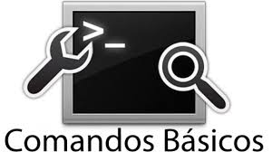

# Comandos Basicos de Gitbash   

Para poder navegar en la consola gitbash es necesario conocer los comandos basicos de esta, los cuales son:  

-_pwd_  (print working directory): Este comando muestra la ruta del directorio actual en el que te encuentras.  

-_ls_ (list): Este comando lista los archivos y directorios dentro del directorio actual.
 
-_ls -al_:  Muestra todos los archivos, incluyendo los ocultos.  

-_cd nombre_directorio/_: se usa para moverse entre carpetas.  

-_cd.._: se usa para regresar al directorio anterior.  

-_mkdir nombre_directorio_: permite crear una nueva carpeta.  

-_touch nombre_archivo_: crea un archivo vacío, útil para iniciar nuevos documentos o scripts.  

-_mv_: se usa para mover o renombrar archivos y carpetas.  

-_cp_: permite copiar archivos y directorios (cp -r para copiar carpetas con su contenido).  

-_rm_: borra archivos, mientras que rm -r elimina carpetas junto con su contenido.

 

