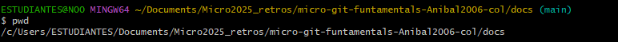
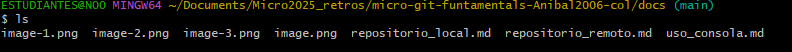
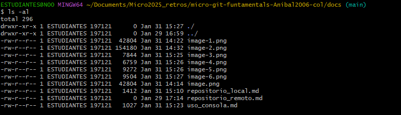
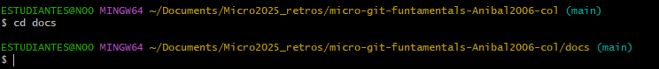
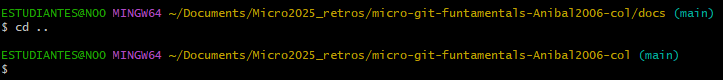

# Comandos Basicos de Gitbash   

Para poder navegar en la consola gitbash es necesario conocer los comandos basicos de esta, los cuales son:  

- `pwd (print working directory)`: Este comando muestra la ruta del directorio actual en el que te encuentras.  

- `ls (list)`: Este comando lista los archivos y directorios dentro del directorio actual.  

- `ls -al`:  Muestra todos los archivos, incluyendo los ocultos.  

- `cd nombre_directorio/`: Se usa para moverse entre carpetas.  

- `cd..`: Se usa para regresar al directorio anterior.  

- `mkdir nombre_directorio`: Permite crear una nueva carpeta.  

- `touch nombre_archivo`: Crea un archivo vacío, útil para iniciar nuevos documentos o scripts.  

- `mv` Se usa para mover o renombrar archivos y carpetas.  

- `cp`: Permite copiar archivos y directorios (cp -r para copiar carpetas con su contenido).  

- `rm`: Borra archivos, mientras que rm -r elimina carpetas junto con su contenido.

